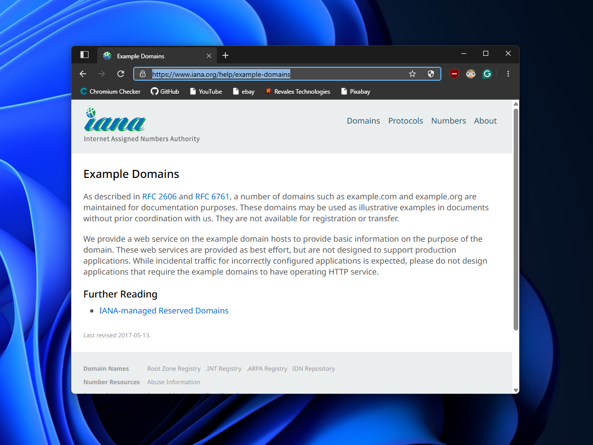

<p align="center">
  <a href="https://revalextechnologiess.github.io"></a>
</p>

<div align="center">
  <h1>Selenix Browser</h1>

[](https://github.com/Revalex-Technologies/selenix-Browser/actions)
[](https://revalextechnologies.github.io)
[](https://discord.gg/x6BKcWM4pf)

Selenix is a web browser built from wexond base (the version used was prior to them closing the code), on top of modern web technologies such as `Electron` and `React`, that can also be used as a framework to create a custom web browser (see the [License](#license) section).

</div>

# Table of Contents:
- [Motivation](#motivation)
- [Features](#features)
- [Screenshot](#screenshot)
- [Downloads](#downloads)
- [Contributing](#contributing)
- [Development](#development)
  - [Running](#running)
- [Documentation](#documentation)
- [License](#license)

## Motivation

The Wexond team discontinued and later sold their project some time ago. I have always admired their work, and this repository is an effort to build upon it while staying within legal and licensing requirements. Specifically, this project is based on a commit tagged **v5.2.0** in the original repository, which included the GPL license file. That version can be found [here](https://github.com/wexond/browser-base/tree/v5.2.0).  

As developers, many of us have attempted to compile Chromium from source, only to find the process extremely time-consuming and resource-intensive. **Selenix** aims to address that challenge by leveraging the foundation provided by Wexond’s project, now updated to support modern Node.js and Electron versions.  

# Features

- **selenix Shield** - Browse the web without any ads and don't allow websites to track you. Thanks to the selenix Shield powered by [ghostery](https://github.com/ghostery/adblocker), websites can load even 8 times faster!
- **Chromium without Google services and low resources usage** - Since selenixuses Electron and wexond under the hood which is based on only several and the most important Chromium components, it's not bloated with redundant Google tracking services and others.
- **Fast and fluent UI** - The animations are really smooth and their timings are perfectly balanced.
- **Highly customizable new tab page** - Customize almost an every aspect of the new tab page!
- **Customizable browser UI** - Choose whether Selenix should have compact or normal UI.
- **Tab groups** - Easily group tabs, so it's hard to get lost.
- **Scrollable tabs**
- **chrome extensions support** - install your favorite extensions from any chromium browser into Selenix Browser instructions on setting this up can be found in [`docs/extensions`](docs/extensions.md)


## Other basic features

- Downloads popup with currently downloaded items and a download manager WebUI page
- History manager
- Bookmarks bar & manager
- Settings
- Find in page
- Dark and light theme
- Omnibox with autocomplete algorithm similar to Chromium
- State of the art tab system along with tab tearing.

# Preview



# Downloads
- [Stable](https://github.com/Revalex-Technologies/Selenix-Browser/releases)

# Development

## Running

Make sure you have the latest version of node.js which you can find * [`here`](https://nodejs.org/en/)

to switch between node versions you will need nvm (node version mamager) which you can find [`here`](https://github.com/nvm-sh/nvm/releases).


### Type These commands for installing deps, building, running, or compiling.

Make sure you have corepack enabled. You can do so by running these commands

```bash
$ sudo corepack enable # enables corepack for node.js + linux
```

for windows run the command below as **administrator**:

```bash
$ corepack enable # enables corepack for node.js
```

```bash
$ yarn install # Install needed depedencies.
$ yarn run build # build native modules using Electron headers.
$ yarn run rebuild # Rebuild native modules using Electron headers.
$ yarn run dev # Run Selenix in development mode
$ yarn run start # Run Selenix in production mode
```

### More commands

```bash
$ yarn run compile-win32 # Package Selenix for Windows
$ yarn run compile-linux # Package Selenix for Linux
$ yarn run compile-darwin # Package Selenix for macOS
$ yarn run lint # Runs linter
$ yarn run lint-fix # Runs linter and automatically applies fixes
```

More commands can be found in [`package.json`](package.json).

# Documentation

Guides and the API reference are located in [`docs`](docs) directory.

# Contributing

if you wish to contribute in any way, shape or form please give the [`Contributing License Agreement a Read`](CONTRIBUTING.md)


# License

This project is licensed under [GPL-3](LICENSE) and an additional license under [PATENTS](PATENTS) file.
